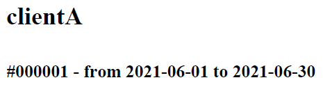
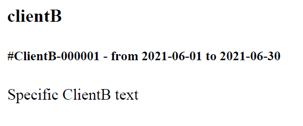

# Dummy App
Dummy App used as PoC to create client specific implementation using environments in a Symfony App.

## When APP_ENV=dev | APP_ENV=prod
* [Core implementation](../blob/master/src/Core/Billing/Infrastructure/Generator/PdfBillGenerator.php) is used. 
* [Core template](../blob/master/templates/core/billing/pdf/bill.pdf.twig) is used.

## When APP_ENV=clientA
As there is no specific implementation neither the template has been overwritten, the core implementation & template are used.

## When APP_ENV=clientB
* [ClientB specific implementation](../blob/master/src/ClientB/Billing/Infrastructure/Generator/PdfBillGenerator.php) is used (extending the Core one).
* [ClientB specific template](../blob/master/templates/client_b/billing/pdf/bill.pdf.twig) is used.

